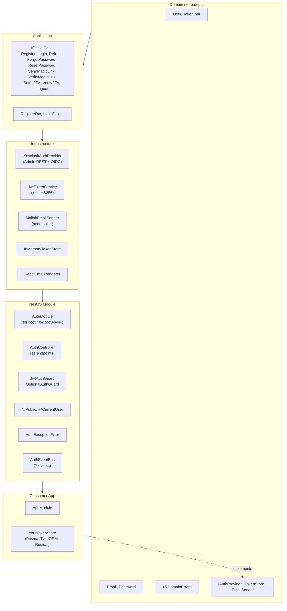
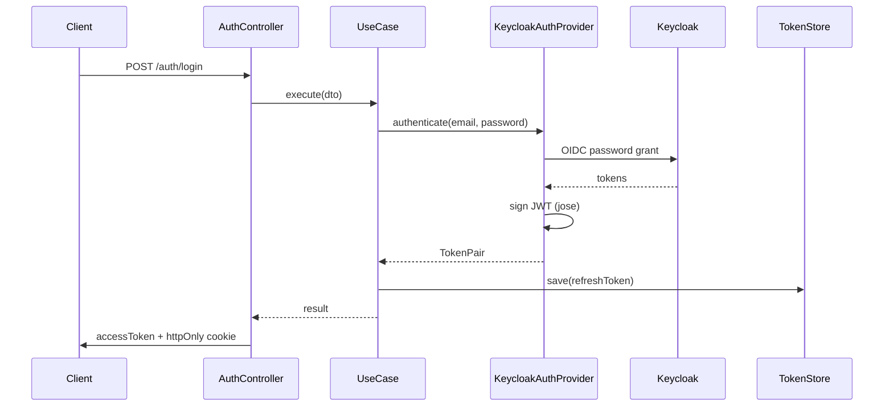
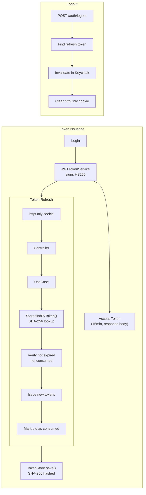
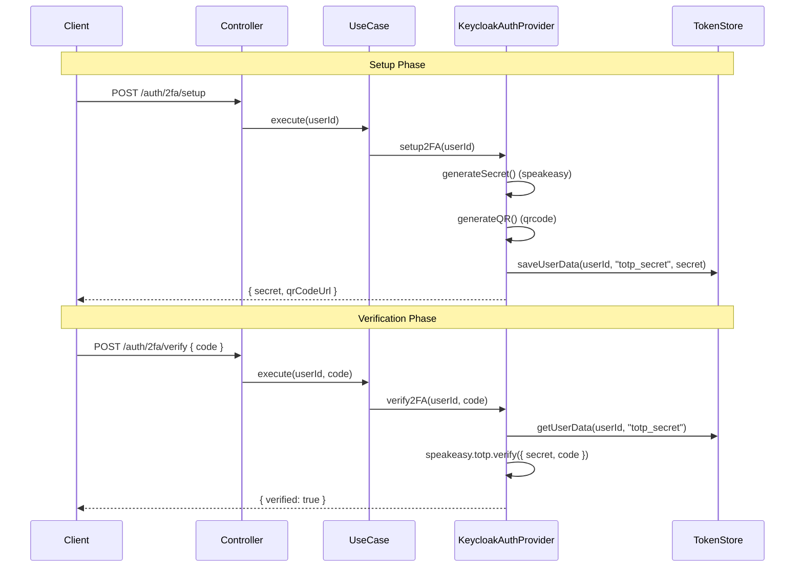

# Architecture

## Clean Architecture Layers

The package follows Clean Architecture with strict dependency rules: outer layers depend on inner layers, never the reverse.



## Request Flow



## Token model: Keycloak for identity, local JWTs for sessions

This is important to understand before deploying: the package uses a **hybrid**
model.

- **Keycloak is the identity authority.** It stores users and credentials and
  validates the password on login (OIDC password grant), and it owns the
  register / password-reset / email-verify operations via the Admin REST API.
- **The session authority is this service's own HS256 secret.** On successful
  login the Keycloak tokens are discarded and the package signs its *own*
  access and refresh JWTs with `JwtTokenService`. `/auth/refresh` verifies and
  rotates those local JWTs and never calls Keycloak.

Practical consequences:

- Revocation is enforced by the **token store**, not by Keycloak. `logout`,
  refresh-token rotation, reuse detection, and "revoke all sessions" (after a
  password reset or detected reuse) all work through `ITokenStore`. This is why
  a correct store implementation is security-critical — see
  [Custom Token Store](../guides/custom-token-store.md).
- `POST /auth/logout` marks the refresh token consumed locally; the best-effort
  call to Keycloak's logout endpoint does not govern your sessions.
- Because access tokens are HS256 signed by your secret (not RS256 from
  Keycloak), rotate `ACCESS_TOKEN_SECRET` / `REFRESH_TOKEN_SECRET` on any
  suspected compromise. Keep the two secrets distinct — the module enforces
  this at startup, and tokens carry a `typ` claim so an access token can never
  be replayed as a refresh token.

## Token Flow



## 2FA Flow



## Package Structure

```
@luisjrez/nestjs-keycloak-auth/
├── domain/
│   ├── entities/           User, TokenPair
│   ├── value-objects/      Email, Password
│   ├── errors/             DomainError, 16 AuthErrors
│   └── ports/              IAuthProvider, IEmailSender, ITokenStore
├── application/
│   ├── dtos/               RegisterDto, LoginDto, ...
│   └── use-cases/          10 use cases
├── infrastructure/
│   ├── keycloak/           KeycloakAuthProvider
│   ├── jwt/                JwtTokenService
│   ├── email/              MailpitEmailSender, ReactEmailRenderer
│   └── storage/            InMemoryTokenStore
├── nestjs/
│   ├── auth.module.ts
│   ├── controllers/        AuthController (11 endpoints)
│   ├── guards/             JwtAuthGuard, OptionalAuthGuard
│   ├── decorators/         @Public, @CurrentUser
│   ├── filters/            AuthExceptionFilter
│   └── events/             AuthEventBus + 7 events
└── cli/                    auth-cli (init, export, import)
```
